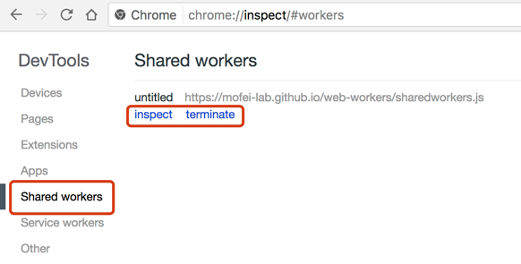
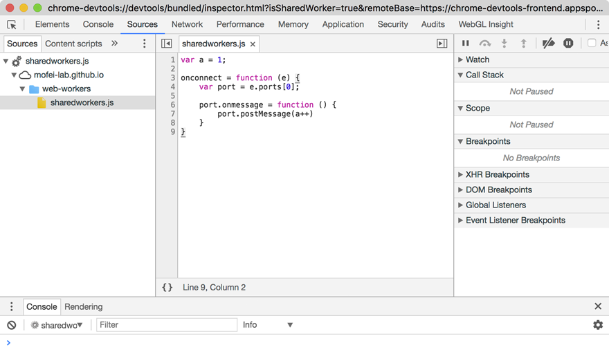

# shareWorker的调试
大家尝试开发sharedworkders的时候，可能会发现这样的问题，普通workder可以很方便的通过控制台来调试，但是sharedworkders是后台线程，很难去调试，我在开发的时候就遇到下面的问题：

- sharedWorkder 的 console 信息不会在控制台中展示，怎么去打断点？
- sharedWorkder 的缓存比较严重，修改了代码之后浏览器还是会运行之前的脚本，缓存该如何清除？
  其实在chrome浏览器中我们可以通过chrome://inspect/来很方便的调试shareWorker。
  

打开页面之后，选择 Shared workres 我们就可以看到所有的正在运行的shareWorker了，这里有2个按钮 一个是inspect另外一个是terminate，terminate很容易理解，就是结束线程。

这里我们尝试使用inspect。

